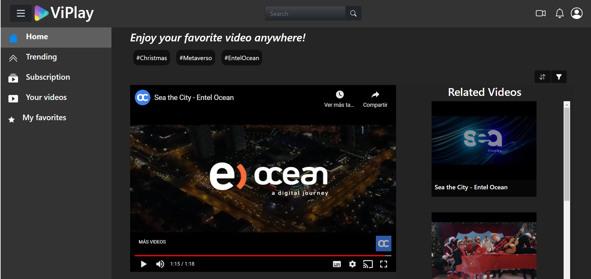

# ViPlay

## Índice

* [1. Descripción general](#1-descripción-general)
* [2. Interfaz](#2-interfaz)
* [3. Tecnologías](#3-tecnologías)

***
## 1. Descripción general

Desarrollo de Interfaz de reproducción de videos para desafío técnico de Entel Ocean.

## 2. Interfaz
[Prototipo de baja fidelidad-Figma-](https://www.figma.com/proto/VJ89bkTrRwU2svL1N2hsRA/Frontend-challenge-layout?node-id=0%3A2&scaling=contain&page-id=0%3A1)

## 3. Tecnologías

* React.js.
* JavaScript ES6.
* Bootstrap 5.
